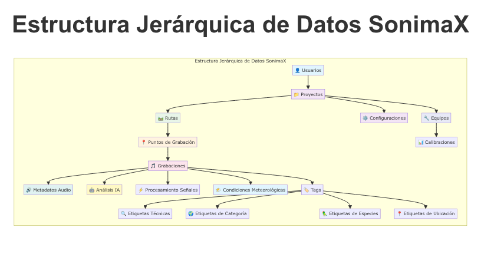
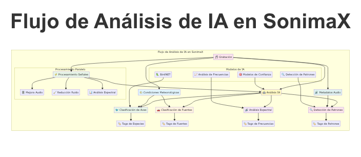
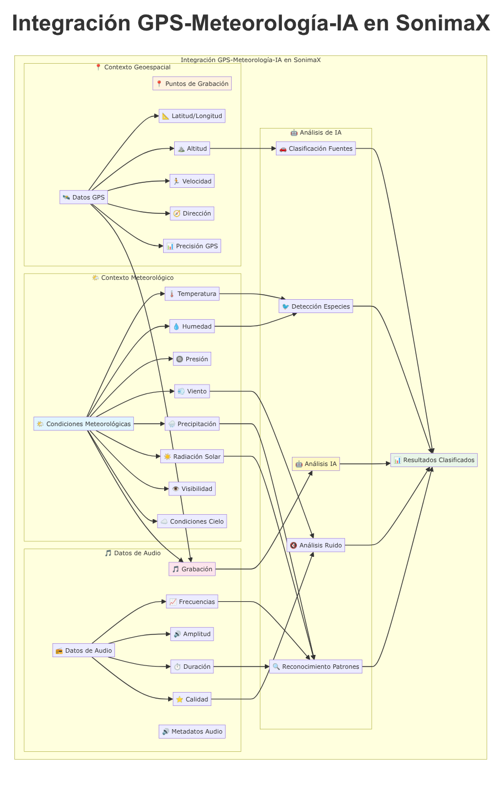

# Esquema integral de base de datos para SonimaX: grabaciones de campo, metadatos, IA y meteorología

## Resumen ejecutivo y alcance

SonimaX es una plataforma conceived para la captura, organización y análisis de grabaciones acústicas de campo, con soporte explícito para metadatos GPS, condiciones meteorológicas sincronizadas y procesos de inteligencia artificial (IA) que enriquecen el conocimiento del paisaje sonoro. Este documento define un blueprint completo del esquema de base de datos que soporta casos de uso operativos y científicos: desde la planificación de proyectos y rutas, pasando por la toma y validación de datos, hasta la publicación y el análisis posterior con modelos de IA y métricas de calidad.

El alcance abarca el diseño lógico y físico de entidades, relaciones y restricciones, la estrategia de integridad referencial y borrado/actualización, la definición de índices e implicaciones de performance, el tratamiento de metadatos (especialmente GPS y audio en compatibilidad con estándares), un diccionario de variables meteorológicas alineado a buenas prácticas, un modelo de versionado y trazabilidad para IA, seguridad y auditoría, y un plan de entrega con artefactos SQL y documentación. Los resultados esperados incluyen: (i) una base de datos consistente y extensible que refleje fielmente el dominio de grabación de campo, (ii) una arquitectura preparada para escalar en volumen y complejidad, y (iii) artefactos técnicos listos para implementación y prueba.

Metodológicamente, el blueprint integra: recomendaciones meteorológicas regulatorias para asegurar la calidad y trazabilidad de la información ambiental[^1], prácticas consolidadas de organización y documentación de grabaciones de campo que sustentan el diseño de metadatos[^2], y el uso de etiquetas estandarizadas ID3 cuando corresponda para interoperabilidad sin duplicar información crítica en la base relacional[^3]. La estructura de proyectos, rutas y puntos toma inspiración de esquemas públicos de ensayos de campo, adaptados al dominio acústico[^5].

Brechas de información y supuestos operativos:
- Motor de base de datos no especificado: se propone un diseño SQL agnóstico con notas de portabilidad.
- Volúmenes de datos y tasas de muestreo desconocidos: se formulan índices y estrategias generales.
- Catálogo de modelos de IA, etiquetas y métricas: se modela con extensibilidad y versionado.
- Políticas regulatorias específicas y latencias de ingestión: se sugieren campos y estados sin fijar SLA.
- Formatos/codecs concretos de audio: se contemplan campos técnicos habituales y espacio para metadatos embebidos.
- Fuentes y formatos de datos meteorológicos: se adopta un diccionario de variables primarias conforme a guías de referencia.
- Dispositivos GPS y métodos de captura: se modelan metadatos de precisión y calidad sin fijar hardware.
- Requerimientos de seguridad y cumplimiento (PII, cifrado, RBAC detallado): se proponen mínimos y una estructura de auditoría extensible.
- Política de versionado de configuraciones: se propone un enfoque efectivo por alcance y timestamps.
- Taxonomías de tags: se contemplan namespaces y slugs con gobernanza pendiente.

La solución propuesta sirve como base para ingeniería de datos, arquitectos/as de software, administradores/as de base de datos, investigadores/as de campo y analistas de IA, facilitando una implementación robusta y evolutiva.

---

## Contexto operativo y principios de diseño del esquema

En el entorno de SonimaX, equipos de campo planifican rutas, identifican puntos de interés, capturan audio y registran condiciones contextuales (GPS y meteorología). A su retorno, se ingiere la información, se valida y se enriquece con análisis automáticos o semiautomáticos (detección de especies, clasificación de fuentes, caracterización espectral). Este ciclo exige una base de datos con trazabilidad temporal y espacial, estandarización de metadatos y capacidad de auditoría.

Principios rectores:
- Normalización pragmática: evitar duplicidad, pero preservar derivados cuando agregan valor (p. ej., RMS/Peak, offsets de IA).
- Jerarquía explícita: proyectos → rutas → puntos → grabaciones, con vínculos a equipos, meteorología y análisis.
- Trazabilidad: claves primarias estables (UUID), timestamps con zona horaria, campos de estado y auditoría.
- Extensibilidad: uso de JSON para metadatos flexibles; catálogos enumerados para estados y tipos.
- QA/QC: niveles y estados de validación en meteorología; reglas de negocio para coherencia de datos.
- Metadatos GPS: captura de coordenadas, altitud, precisión (HDOP/PDOP), velocidad/rumbo y fix_type.
- Estándares de audio: compatibilidad con ID3 donde aplique, sin duplicar campos relacionales críticos[^3][^4].
- Organización y respaldo: estructuras consistentes con prácticas de campo profesional y reporting[^2].

Estos principios se traducen en decisiones concretas (tipos de datos, restricciones, índices) y en artefactos (vistas y diccionarios) que permiten operar el sistema con eficiencia y rigor científico.

---

## Modelo conceptual global (ER narrativo)

La arquitectura conceptual pivota sobre una jerarquía lineal que organiza el trabajo y los datos asociados:

- Un Usuario crea uno o más Proyectos.
- Cada Proyecto contiene múltiples Rutas.
- Cada Ruta agrega múltiples Puntos de Grabación.
- En cada Punto se realizan Grabaciones.
- Cada Grabación tiene:
  - Metadatos de audio (1:1).
  - Cero o más Análisis de IA.
  - Cero o más Tags (asociación N:M).
  - Eventual Observación Meteorológica asociada.

Otras entidades complementan el modelo:
- Equipos de grabación y sensores, con historial de calibraciones.
- Configuraciones con alcance (global, proyecto, ruta) y versionado efectivo.
- Catálogos para Tags y Estados (grabación, QA meteorológica).

Para contextualizar la jerarquía operativa y los flujos de datos, se muestran a continuación dos diagramas. El primero sintetiza la jerarquía de proyectos, rutas, puntos y grabaciones; el segundo ilustra el flujo de análisis de IA y su relación con segmentos temporales de las grabaciones.

La matriz siguiente resume relaciones y cardinalidades. Esta matriz guía las claves foráneas, políticas de borrado/actualización y la definición de índices compuestos para consultas frecuentes.

Tabla 1. Matriz de relaciones y cardinalidades

| Origen              | Destino               | Tipo     | Cardinalidad | Clave foránea                                      |
|---------------------|-----------------------|----------|--------------|----------------------------------------------------|
| usuarios            | proyectos             | 1—N      | N/A          | proyectos.usuario_id → usuarios.id                 |
| proyectos           | rutas                 | 1—N      | N/A          | rutas.proyecto_id → proyectos.id                   |
| rutas               | puntos_grabacion      | 1—N      | N/A          | puntos_grabacion.ruta_id → rutas.id                |
| puntos_grabacion    | grabaciones           | 1—N      | N/A          | grabaciones.punto_id → puntos_grabacion.id         |
| grabaciones         | metadatos_audio       | 1—1      | N/A          | metadatos_audio.grabacion_id → grabaciones.id      |
| grabaciones         | analisis_ia           | 1—N      | N/A          | analisis_ia.grabacion_id → grabaciones.id          |
| grabaciones         | grabaciones_tags      | N—1      | N/A          | grabaciones_tags.grabacion_id                      |
| tags                | grabaciones_tags      | N—1      | N/A          | grabaciones_tags.tag_id                            |
| grabaciones         | observaciones_meteo   | 1—N (opt)| N/A          | observaciones_meteo.grabacion_id → grabaciones.id  |
| equipos             | grabaciones           | 1—N (opt)| N/A          | grabaciones.equipo_id → equipos.id                 |
| equipos             | calibraciones         | 1—N      | N/A          | calibraciones.equipo_id → equipos.id               |
| configuraciones     | proyectos             | 1—N (opt)| N/A          | configuraciones.proyecto_id                        |
| configuraciones     | rutas                 | 1—N (opt)| N/A          | configuraciones.ruta_id                            |

Esta estructura se inspira en modelos de ensayos de campo, adaptados a la naturaleza acústica y al uso de metadatos de captura[^5][^2].

---

## Diseño lógico y diccionario de datos

Se detallan tablas principales y columnas, con tipos SQL abstractos, restricciones y default. Se adoptan UUID como PK, TIMESTAMPTZ para tiempos con zona horaria, DOUBLE PRECISION para coordenadas y métricas numéricas, BOOLEAN para flags, INTEGER para contadores/duraciones, TEXT/VARCHAR para textos y JSON para metadatos flexibles. Se usa ENUM o catálogo de texto para estados normalizados. Se incluyen auditoría y trazabilidad (created_at, updated_at, estados).

### Usuarios

Tabla usuarios

| Campo          | Tipo          | Null | Default               | Descripción                                       |
|----------------|---------------|------|-----------------------|---------------------------------------------------|
| id             | UUID          | No   | gen_random_uuid()     | PK                                                |
| email          | VARCHAR(255)  | No   |                       | Único                                             |
| nombre         | VARCHAR(120)  | No   |                       |                                                   |
| apellido       | VARCHAR(120)  | No   |                       |                                                   |
| rol            | VARCHAR(50)   | Sí   | 'operador'            | admin, analista, operador                         |
| estado         | VARCHAR(20)   | Sí   | 'activo'              | activo, inactivo                                  |
| password_hash  | TEXT          | No   |                       | Hash de contraseña                                |
| last_login_at  | TIMESTAMPTZ   | Sí   |                       |                                                   |
| created_at     | TIMESTAMPTZ   | No   | now()                 |                                                   |
| updated_at     | TIMESTAMPTZ   | No   | now()                 |                                                   |
| metadata       | JSON          | Sí   | '{}'                  | Preferencias, OAUTH, etc.                         |

Restricciones: PK(id), UK(email). CHK estado ∈ {'activo','inactivo'}.

Índices: idx_usuarios_email (UNIQUE), idx_usuarios_rol.

### Proyectos

Tabla proyectos

| Campo         | Tipo          | Null | Default | Descripción                             |
|---------------|---------------|------|---------|-----------------------------------------|
| id            | UUID          | No   |         | PK                                      |
| nombre        | VARCHAR(200)  | No   |         | Único                                   |
| descripcion   | TEXT          | Sí   |         |                                         |
| owner_id      | UUID          | No   |         | FK → usuarios.id                        |
| fecha_inicio  | DATE          | Sí   |         |                                         |
| fecha_fin     | DATE          | Sí   |         |                                         |
| status        | VARCHAR(20)   | Sí   | 'planificado' | planificado, activo, pausado, completado |
| created_at    | TIMESTAMPTZ   | No   | now()   |                                         |
| updated_at    | TIMESTAMPTZ   | No   | now()   |                                         |
| metadata      | JSON          | Sí   | '{}'    |                                         |

Restricciones: PK(id), UK(nombre), CHK status ∈ {...}.

Índices: idx_proyectos_owner_id, idx_proyectos_status.

### Rutas

Tabla rutas

| Campo         | Tipo          | Null | Default | Descripción |
|---------------|---------------|------|---------|-------------|
| id            | UUID          | No   |         | PK          |
| proyecto_id   | UUID          | No   |         | FK → proyectos.id |
| nombre        | VARCHAR(200)  | No   |         |             |
| descripcion   | TEXT          | Sí   |         |             |
| created_at    | TIMESTAMPTZ   | No   | now()   |             |
| updated_at    | TIMESTAMPTZ   | No   | now()   |             |
| metadata      | JSON          | Sí   | '{}'    |             |

Índices: idx_rutas_proyecto_id, idx_rutas_nombre.

Relación N:M con Tags (opcional): rutas_tags (ruta_id, tag_id) PK compuesta.

### Puntos de grabación

Tabla puntos_grabacion

| Campo            | Tipo             | Null | Default | Descripción |
|------------------|------------------|------|---------|-------------|
| id               | UUID             | No   |         | PK          |
| ruta_id          | UUID             | No   |         | FK → rutas.id |
| nombre           | VARCHAR(200)     | Sí   |         |             |
| latitud          | DOUBLE PRECISION | No   |         | grados      |
| longitud         | DOUBLE PRECISION | No   |         | grados      |
| altitud_m        | DOUBLE PRECISION | Sí   |         | m           |
| hdop             | DOUBLE PRECISION | Sí   |         | precisión horizontal |
| pdop             | DOUBLE PRECISION | Sí   |         | precisión vertical   |
| velocidad_kmh    | DOUBLE PRECISION | Sí   |         |             |
| heading_grados   | DOUBLE PRECISION | Sí   |         | 0–360       |
| fix_type         | VARCHAR(20)      | Sí   |         | 2D, 3D, no_fix |
| timestamp_gps    | TIMESTAMPTZ      | Sí   |         |             |
| created_at       | TIMESTAMPTZ      | No   | now()   |             |
| updated_at       | TIMESTAMPTZ      | No   | now()   |             |
| metadata_gps     | JSON             | Sí   | '{}'    | fuente, calidad señal |

Restricciones: PK(id), FK(ruta_id). CHK fix_type ∈ {'no_fix','2D','3D'}, CHK lat/lon rangos.

Índices: idx_pg_ruta_id; idx_pg_coords (latitud, longitud) para bounding-box.

### Grabaciones

Tabla grabaciones

| Campo            | Tipo             | Null | Default | Descripción |
|------------------|------------------|------|---------|-------------|
| id               | UUID             | No   |         | PK          |
| punto_id         | UUID             | No   |         | FK → puntos_grabacion.id |
| equipo_id        | UUID             | Sí   |         | FK → equipos.id (nullable) |
| timestamp_inicio | TIMESTAMPTZ      | No   |         |             |
| timestamp_fin    | TIMESTAMPTZ      | No   |         |             |
| duracion_seg     | INTEGER          | No   |         |             |
| formato_archivo  | VARCHAR(20)      | Sí   |         | WAV, FLAC, MP3 |
| path_archivo     | TEXT             | Sí   |         | ruta lógica |
| estado           | VARCHAR(20)      | Sí   | 'draft' | draft, ingestado, validado, publicado |
| created_at       | TIMESTAMPTZ      | No   | now()   |             |
| updated_at       | TIMESTAMPTZ      | No   | now()   |             |
| metadata         | JSON             | Sí   | '{}'    | notas, flags |

Restricciones: PK(id), FK(punto_id). CHK timestamp_fin > timestamp_inicio, CHK estado ∈ {...}.

Índices: idx_grabaciones_punto_id, idx_grabaciones_tiempo (timestamp_inicio, timestamp_fin), idx_grabaciones_estado, idx_grabaciones_formato, opcional GIN sobre metadata.

### Metadatos de audio

Tabla metadatos_audio

| Campo         | Tipo             | Null | Default | Descripción |
|---------------|------------------|------|---------|-------------|
| id            | UUID             | No   |         | PK          |
| grabacion_id  | UUID             | No   |         | UNIQUE FK → grabaciones.id |
| codec         | VARCHAR(20)      | No   |         | PCM, AAC, MP3 |
| sample_rate_hz| INTEGER          | No   |         | Hz          |
| bit_rate_kbps | INTEGER          | Sí   |         | kbps        |
| channels      | INTEGER          | No   |         |             |
| bit_depth     | INTEGER          | Sí   |         | 16, 24      |
| contenedor    | VARCHAR(20)      | Sí   |         | WAV, FLAC, MP4 |
| rms_db        | DOUBLE PRECISION | Sí   |         |             |
| peak_db       | DOUBLE PRECISION | Sí   |         |             |
| notes         | TEXT             | Sí   |         |             |
| id3_raw       | JSON             | Sí   | '{}'    | Etiquetas ID3 |

Índices: idx_meta_codec_sample (codec, sample_rate_hz).

La inclusión de id3_raw facilita compatibilidad con estándares sin duplicar campos ya presentes en metadatos_audio y en la estructura relacional[^3][^4].

### Tags

Tabla tags

| Campo      | Tipo          | Null | Default | Descripción |
|------------|---------------|------|---------|-------------|
| id         | UUID          | No   |         | PK          |
| nombre     | VARCHAR(100)  | No   |         |             |
| slug       | VARCHAR(100)  | No   |         | Único       |
| tipo       | VARCHAR(50)   | Sí   | 'tema'  | especie, evento, location, tecnica |
| color      | VARCHAR(7)    | Sí   |         | #RRGGBB     |
| created_at | TIMESTAMPTZ   | No   | now()   |             |

Restricciones: PK(id), UK(slug), CHK tipo ∈ {'tema','especie','evento','location','tecnica'}.

Tabla puente grabaciones_tags: (grabacion_id, tag_id) PK compuesta.

### Análisis de IA

Tabla analisis_ia

| Campo                 | Tipo          | Null | Default | Descripción |
|-----------------------|---------------|------|---------|-------------|
| id                    | UUID          | No   |         | PK          |
| grabacion_id          | UUID          | No   |         | FK → grabaciones.id |
| modelo_nombre         | VARCHAR(100)  | No   |         |             |
| modelo_version        | VARCHAR(50)   | No   |         |             |
| tipo_analisis         | VARCHAR(50)   | No   |         | deteccion_especies, clasificacion_fuente |
| score                 | DOUBLE PRECISION | Sí |         |             |
| time_offset_inicio_seg| INTEGER       | Sí   |         |             |
| time_offset_fin_seg   | INTEGER       | Sí   |         |             |
| label                 | VARCHAR(100)  | Sí   |         |             |
| metadatos             | JSON          | Sí   | '{}'    | métricas, params |
| created_at            | TIMESTAMPTZ   | No   | now()   |             |

Restricciones: PK(id), FK(grabacion_id), CHK time_offset_fin_seg ≥ time_offset_inicio_seg.

Índices: idx_ia_grabacion_id, idx_ia_modelo (modelo_nombre, modelo_version), idx_ia_time.

### Observaciones meteorológicas

Tabla observaciones_meteo

| Campo                 | Tipo             | Null | Default | Descripción |
|-----------------------|------------------|------|---------|-------------|
| id                    | UUID             | No   |         | PK          |
| proyecto_id           | UUID             | Sí   |         | FK → proyectos.id |
| ruta_id               | UUID             | Sí   |         | FK → rutas.id |
| punto_id              | UUID             | Sí   |         | FK → puntos_grabacion.id |
| grabacion_id          | UUID             | Sí   |         | FK → grabaciones.id |
| timestamp_obs         | TIMESTAMPTZ      | No   |         |             |
| latitud               | DOUBLE PRECISION | Sí   |         |             |
| longitud              | DOUBLE PRECISION | Sí   |         |             |
| altitud_m             | DOUBLE PRECISION | Sí   |         |             |
| velocidad_viento_ms   | DOUBLE PRECISION | Sí   |         | m/s         |
| direccion_viento_grados| DOUBLE PRECISION| Sí   |         | 0–360       |
| temperatura_c         | DOUBLE PRECISION | Sí   |         | °C          |
| humedad_pct           | DOUBLE PRECISION | Sí   |         | %           |
| precipitacion_mm      | DOUBLE PRECISION | Sí   |         | mm          |
| presion_hpa           | DOUBLE PRECISION | Sí   |         | hPa         |
| radiacion_wm2         | DOUBLE PRECISION | Sí   |         | W/m²        |
| cielo                 | VARCHAR(20)      | Sí   |         | despejado, nublado, lluvia, nieve |
| precipitacion_tipo    | VARCHAR(20)      | Sí   |         | none, drizzle, rain, snow, hail |
| condiciones_especiales| VARCHAR(100)     | Sí   |         | niebla, tormenta, viento fuerte |
| source                | VARCHAR(20)      | Sí   | 'manual'| manual, api, estacion, sensor |
| qa_status             | VARCHAR(20)      | Sí   | 'pendiente' | pendiente, validado, rechazado |
| notas                 | TEXT             | Sí   |         |             |
| created_at            | TIMESTAMPTZ      | No   | now()   |             |

Restricciones: PK(id); FK opcionales; CHK cielo ∈ {...}, precipitacion_tipo ∈ {...}, qa_status ∈ {...}.

Índices: idx_meteo_timestamp, idx_meteo_coords, idx_meteo_proyecto_ruta.

Las variables y estados de QA/QC se alinean a guías de monitoreo meteorológico aplicables a modelado y validación[^1].

### Equipos

Tabla equipos

| Campo         | Tipo          | Null | Default | Descripción |
|---------------|---------------|------|---------|-------------|
| id            | UUID          | No   |         | PK          |
| tipo          | VARCHAR(30)   | No   |         | grabadora, microfono, sensor_meteo |
| marca         | VARCHAR(50)   | Sí   |         |             |
| modelo        | VARCHAR(50)   | Sí   |         |             |
| serie         | VARCHAR(50)   | Sí   |         |             |
| firmware      | VARCHAR(50)   | Sí   |         |             |
| config_actual | JSON          | Sí   | '{}'    |             |
| status        | VARCHAR(20)   | Sí   | 'activo'| activo, mantenimiento, baja |
| owner_user_id | UUID          | Sí   |         | FK → usuarios.id |
| created_at    | TIMESTAMPTZ   | No   | now()   |             |
| updated_at    | TIMESTAMPTZ   | No   | now()   |             |

Tabla calibraciones

| Campo          | Tipo          | Null | Default | Descripción |
|----------------|---------------|------|---------|-------------|
| id             | UUID          | No   |         | PK          |
| equipo_id      | UUID          | No   |         | FK → equipos.id |
| fecha_cal      | DATE          | No   |         |             |
| procedimiento  | VARCHAR(100)  | Sí   |         |             |
| resultado      | VARCHAR(20)   | Sí   |         | pasado, fallido |
| certificado_no | VARCHAR(50)   | Sí   |         |             |
| notes          | TEXT          | Sí   |         |             |
| created_at     | TIMESTAMPTZ   | No   | now()   |             |

### Configuraciones

Tabla configuraciones

| Campo       | Tipo          | Null | Default | Descripción |
|-------------|---------------|------|---------|-------------|
| id          | UUID          | No   |         | PK          |
| scope       | VARCHAR(20)   | No   | 'global'| global, proyecto, ruta |
| proyecto_id | UUID          | Sí   |         | FK → proyectos.id |
| ruta_id     | UUID          | Sí   |         | FK → rutas.id |
| nombre      | VARCHAR(100)  | No   |         |             |
| payload     | JSON          | No   | '{}'    | gain, filtros, params |
| version     | INTEGER       | Sí   | 1       |             |
| activa      | BOOLEAN       | Sí   | true    |             |
| created_at  | TIMESTAMPTZ   | No   | now()   |             |
| updated_at  | TIMESTAMPTZ   | No   | now()   |             |

---

## Metadatos GPS y estándares de audio

La captura en campo requiere registrar ubicación y calidad de la posición, así como parámetros técnicos del audio. El diseño model'se explícitamente en puntos_grabacion:

- Coordenadas (latitud, longitud), altitud, velocidad y rumbo.
- Precisión: HDOP y PDOP, fix_type y timestamp_gps.
- Metadatos JSON libres para fuente y observaciones de calidad.

En audio, la tabla metadatos_audio captura los campos clave: codec, sample_rate, bit_rate, channels, bit_depth, contenedor, niveles (RMS/Peak) y notas técnicas. Para compatibilidad con estándares, se almacena un JSON id3_raw con etiquetas embebidas cuando el formato lo permite (p. ej., MP3). Esta separación evita duplicar campos relacionales críticos y habilita interoperabilidad con reproductores y herramientas que usan ID3[^3][^4]. La organización de metadatos y documentación de sesión se alinea con prácticas de campo para asegurar consistencia y recuperabilidad[^2].

La figura siguiente sintetiza el flujo de integración GPS–meteorología–audio y cómo se acopla a las tablas de contexto y observaciones.

Tabla 3. Mapa de campos GPS por entidad

| Entidad            | Campo              | Tipo             | Unidad | Notas                                   |
|--------------------|--------------------|------------------|--------|-----------------------------------------|
| puntos_grabacion   | latitud            | DOUBLE PRECISION | grados | CHK ∈ [-90, 90]                         |
| puntos_grabacion   | longitud           | DOUBLE PRECISION | grados | CHK ∈ [-180, 180]                       |
| puntos_grabacion   | altitud_m          | DOUBLE PRECISION | m      |                                         |
| puntos_grabacion   | hdop               | DOUBLE PRECISION | adim.  | Precisión horizontal                    |
| puntos_grabacion   | pdop               | DOUBLE PRECISION | adim.  | Precisión vertical                      |
| puntos_grabacion   | velocidad_kmh      | DOUBLE PRECISION | km/h   |                                         |
| puntos_grabacion   | heading_grados     | DOUBLE PRECISION | grados | 0–360                                   |
| puntos_grabacion   | fix_type           | VARCHAR(20)      | cat.   | 2D, 3D, no_fix                          |
| puntos_grabacion   | timestamp_gps      | TIMESTAMPTZ      | ts     |                                         |
| observaciones_meteo| latitud/longitud   | DOUBLE PRECISION | grados | Opcionales para contexto                 |
| observaciones_meteo| altitud_m          | DOUBLE PRECISION | m      |                                         |

Tabla 4. Mapa de metadatos de audio y compatibilidad

| Campo         | Descripción           | Estándar relacionado |
|---------------|-----------------------|----------------------|
| codec         | Algoritmo de codificación | ID3/IA SA (compat.) |
| sample_rate_hz| Frecuencia de muestreo     | Práctica común      |
| bit_rate_kbps | Tasa de bits              | ID3                 |
| channels      | Número de canales         | Práctica común      |
| bit_depth     | Profundidad de bits       | Práctica común      |
| contenedor    | Formato contenedor        | ID3/IA SA           |
| rms_db        | Nivel RMS                 | QA técnico          |
| peak_db       | Pico                      | QA técnico          |
| id3_raw       | Etiquetas embebidas       | ID3 v2              |

Estas estructuras permiten preservar la fidelidad de campo y facilitar el acoplamiento con procesos analíticos y de publicación[^2][^3][^4].

---

## Condiciones meteorológicas: variables, unidades y QA/QC

La base de datos adopta un conjunto de variables meteorológicas primarias recomendadas por la EPA: velocidad y dirección del viento, temperatura, humedad, precipitación, presión y radiación. Se añaden clasificaciones operativas de cielo y tipo de precipitación, además de flags de QA/QC. Se registran source (manual, api, estación, sensor) y qa_status (pendiente, validado, rechazado) para auditoría y trazabilidad. El diseño contempla almacenamiento de unidades estándar y timestamps con zona horaria, facilitando agregación y comparabilidad entre sesiones y proyectos[^1].

Tabla 5. Lista de variables meteorológicas

| Variable                | Unidad   | Tipo de dato         | Rango típico     | QA/QC aplicable |
|-------------------------|----------|----------------------|------------------|-----------------|
| velocidad_viento_ms     | m/s      | DOUBLE PRECISION     | ≥ 0              | Plausibilidad   |
| direccion_viento_grados | grados   | DOUBLE PRECISION     | 0–360            | Consistencia    |
| temperatura_c           | °C       | DOUBLE PRECISION     | -50 a 60         | Extremos        |
| humedad_pct             | %        | DOUBLE PRECISION     | 0–100            | Rango           |
| precipitacion_mm        | mm       | DOUBLE PRECISION     | ≥ 0              | Acumulación     |
| presion_hpa             | hPa      | DOUBLE PRECISION     | 800–1200         | Variación       |
| radiacion_wm2           | W/m²     | DOUBLE PRECISION     | ≥ 0              | Irradiancia     |
| cielo                   | categ.   | VARCHAR(20)          | despejado...     | Coherencia      |
| precipitacion_tipo      | categ.   | VARCHAR(20)          | none...          | Coherencia      |
| condiciones_especiales  | texto    | VARCHAR(100)         | libre            | Flags           |
| qa_status               | categ.   | VARCHAR(20)          | pendiente...     | Procedimientos  |

Tabla 6. Niveles de validación (resumen)

| Nivel       | Descripción                         | Procedimiento resumido                   |
|-------------|-------------------------------------|------------------------------------------|
| Pendiente   | Observación sin validar             | Asignación automática; cola de validación|
| Validado    | Observación aprobada                | Revisión automatizada y manual           |
| Rechazado   | Observación descartada              | Motivo documentado; exclusión            |

La guía EPA enfatiza estrategias de muestreo, promediado y tratamiento de datos faltantes; el esquema habilita registrar flags y metadatos de procesamiento en JSON para cumplir con prácticas robustas de QA/QC[^1].

---

## Análisis de IA: modelos, resultados y trazabilidad

Cada resultado de IA se vincula a una grabación y, cuando corresponde, a segmentos temporales dentro de ella (offsets). Se registra el nombre y versión del modelo, el tipo de análisis, la etiqueta detectada, un score de confianza y metadatos adicionales en JSON (métricas por clase, parámetros, umbrales). Esta estructura permite reproducibilidad: un analista puede reconstruir qué modelo, con qué configuración, fue aplicado a qué segmento y con qué resultados. Las vistas analíticas pueden agrupar resultados por etiqueta, proyecto o ventana temporal, acelerando flujos de identificación y reporte[^2].

Tabla 7. Estructura de resultados de IA

| Campo                 | Tipo          | Descripción                               |
|-----------------------|---------------|-------------------------------------------|
| modelo_nombre         | VARCHAR(100)  | Nombre del modelo                         |
| modelo_version        | VARCHAR(50)   | Versión del modelo                        |
| tipo_analisis         | VARCHAR(50)   | deteccion_especies, clasificacion_fuente  |
| label                 | VARCHAR(100)  | Etiqueta/clase                            |
| score                 | DOUBLE PRECISION | Confianza global                        |
| time_offset_inicio_seg| INTEGER       | Inicio del segmento                       |
| time_offset_fin_seg   | INTEGER       | Fin del segmento                          |
| metadatos             | JSON          | Métricas adicionales                      |

Esta aproximación versionada y segmentada garantiza trazabilidad completa y habilita comparativas entre modelos y periodos.

---

## Integridad referencial, borrado/actualización y auditoría

La integridad referencial se asegura con claves foráneas y políticas explícitas:

- Borrado:
  - Proyectos y Rutas: RESTRICT sobre hijos (puntos, grabaciones).
  - Puntos: RESTRICT sobre grabaciones.
  - Grabaciones: CASCADE sobre metadatos_audio, analisis_ia; CASCADE sobre grabaciones_tags en el lado de grabación.
  - Equipos: SET NULL en grabaciones; CASCADE en calibraciones.
  - Configuraciones: SET NULL al eliminar proyecto/ruta (evitar cascadas inadvertidas).
- Actualización:
  - PKs no actualizables; ON UPDATE RESTRICT por defecto.

Tabla 2. Políticas de borrado/actualización por relación

| Relación                         | ON DELETE     | ON UPDATE | Justificación                            |
|----------------------------------|---------------|-----------|------------------------------------------|
| proyectos → rutas                | RESTRICT      | RESTRICT  | Preservar jerarquía                      |
| rutas → puntos                   | RESTRICT      | RESTRICT  | Evitar huérfanas                         |
| puntos → grabaciones             | RESTRICT      | RESTRICT  | Control de integridad                    |
| grabaciones → metadatos_audio    | CASCADE       | RESTRICT  | Eliminación controlada                   |
| grabaciones → analisis_ia        | CASCADE       | RESTRICT  | Eliminación controlada                   |
| grabaciones → grabaciones_tags   | CASCADE (grabación) | RESTRICT | Dependencia directa                 |
| equipos → grabaciones            | SET NULL      | RESTRICT  | Preservar grabaciones                    |
| equipos → calibraciones          | CASCADE       | RESTRICT  | Limpieza de historial                    |
| configuraciones → proyectos/rutas| SET NULL      | RESTRICT  | Evitar cascadas sobre configuraciones    |

Se proponen checks para valores plausibles: rangos de coordenadas, humedad (0–100), velocidad del viento (≥ 0), fin > inicio en grabaciones. La auditoría mínima se instrumenta con created_at/updated_at y una tabla de eventos de auditoría.

---

## Índices, performance y consultas típicas

La estrategia de índices prioriza rutas de acceso frecuentes: jerárquicas (proyecto/ruta/punto), temporales (inicio/fin) y geoespaciales (coords). Se sugieren índices B-tree por FK y por timestamps; índices compuestos para consultas de rango temporal por proyecto/ruta; y GIN sobre columnas JSON para búsquedas por metadatos flexibles. Si el motor lo permite, un índice espacial (GIST) sobre puntos mejorará bounding-box y proximidad.

Ejemplos de consultas típicas:
- Grabaciones por rango temporal y estado: filtrar por timestamp_inicio BETWEEN :inicio AND :fin AND estado = :estado.
- Listado por ruta: JOIN grabaciones → puntos → rutas WHERE ruta_id = :ruta ORDER BY timestamp_inicio.
- IA por etiqueta y modelo: JOIN analisis_ia → grabaciones_tags → tags WHERE tag.slug = :slug AND analisis_ia.modelo_nombre = :modelo.
- Meteorología validada por proyecto: WHERE proyecto_id = :proyecto AND qa_status = 'validado'.

La optimización se complementa con vistas materializadas para agregados recurrentes (p. ej., resumen por ruta) y con particionamiento temporal de grabaciones/meteorología si el volumen lo amerita.

---

## Seguridad, control de acceso y auditoría

Se plantea un RBAC mínimo: admin, analista, operador, solo_lectura. La propiedad de proyectos recae en un owner y la plataforma registra timestamps y estados de cambios. El esquema define una tabla de eventos de auditoría que registra usuario, entidad, acción y detalles en JSON. Recomendaciones de seguridad (cifrado en reposo y tránsito, hashing robusto de contraseñas) deben definirse por política, más allá del modelo de datos.

Tabla 8. Roles vs. permisos (alto nivel)

| Rol         | Alcance                    | Operaciones permitidas                    |
|-------------|----------------------------|-------------------------------------------|
| admin       | Global                     | CRUD total según políticas                |
| analista    | Proyectos asignados        | Lectura/escritura metadatos, registro IA  |
| operador    | Proyectos asignados        | Captura/ingestión/actualización de estado |
| solo_lectura| Proyectos visibles         | Lectura                                   |

Tabla 9. Catálogo de eventos de auditoría

| Campo      | Tipo         | Descripción                 |
|------------|--------------|-----------------------------|
| id         | UUID         | PK                          |
| usuario_id | UUID         | FK → usuarios.id            |
| entidad    | VARCHAR(50)  | Tipo de entidad             |
| entidad_id | UUID         | ID de la entidad            |
| accion     | VARCHAR(20)  | create/update/delete/publish|
| timestamp  | TIMESTAMPTZ  | Momento del evento          |
| detalles   | JSON         | Contexto/cambios            |

---

## Estrategia de versionado, migración y extensibilidad

- IA: versionado explícito por modelo y análisis; metadatos en JSON para parámetros y métricas.
- Configuraciones: alcance (global/proyecto/ruta), campo version y timestamps; reglas efectivas por alcance.
- Esquema: migraciones incrementales numeradas, scripts de upgrade/rollback, changelog; vistas para retrocompatibilidad.

Metadatos flexibles (JSON) permiten añadir claves sin romper el esquema, manteniendo catálogos para enumeraciones. El diseño se mantiene agnóstico de motor, priorizando construcciones estándar SQL.

---

## Plan de entrega y artefactos

La entrega incluye:
- ddl.sql: creación de tablas, claves, restricciones y catálogos.
- idx.sql: índices por tabla, incluidos espaciales si procede.
- vw.sql: vistas analíticas (p. ej., vw_resumen_ruta).
- sample_data.sql: datos de ejemplo.
- README.md: guía de uso, migración y mantenimiento.

Tabla 10. Estructura de artefactos

| Archivo         | Propósito                        | Orden |
|-----------------|----------------------------------|-------|
| ddl.sql         | Definir esquema                  | 1     |
| idx.sql         | Crear índices                    | 2     |
| vw.sql          | Crear vistas                     | 3     |
| sample_data.sql | Poblar ejemplos                  | 4     |
| README.md       | Documentación                    | N/A   |

La organización se inspira en repositorios públicos de esquemas de campo para asegurar consistencia, portabilidad y trazabilidad[^5].

---

## Anexos

Glosario
- HDOP/PDOP: diluciones de precisión horizontal y vertical; miden la calidad geométrica de la solución GPS.
- QA/QC: aseguramiento/control de calidad; niveles y procedimientos de validación.
- ID3: estándar de etiquetas para MP3; se almacenan como JSON para compatibilidad.
- TIMESTAMPTZ: timestamp con zona horaria; recomendado para trazabilidad temporal.

Diccionario de datos (resumen)
- usuarios: id, email (UK), nombre, apellido, rol, estado, password_hash, last_login_at, created_at, updated_at, metadata.
- proyectos: id, nombre (UK), descripcion, owner_id, fecha_inicio, fecha_fin, status, created_at, updated_at, metadata.
- rutas: id, proyecto_id (FK), nombre, descripcion, created_at, updated_at, metadata.
- puntos_grabacion: id, ruta_id (FK), nombre, latitud, longitud, altitud_m, hdop, pdop, velocidad_kmh, heading_grados, fix_type, timestamp_gps, created_at, updated_at, metadata_gps.
- grabaciones: id, punto_id (FK), equipo_id (FK opt.), timestamp_inicio, timestamp_fin, duracion_seg, formato_archivo, path_archivo, estado, created_at, updated_at, metadata.
- metadatos_audio: id, grabacion_id (UNIQUE FK), codec, sample_rate_hz, bit_rate_kbps, channels, bit_depth, contenedor, rms_db, peak_db, notes, id3_raw.
- tags: id, nombre, slug (UK), tipo, color, created_at.
- grabaciones_tags: (grabacion_id, tag_id) PK compuesta.
- analisis_ia: id, grabacion_id (FK), modelo_nombre, modelo_version, tipo_analisis, score, time_offset_inicio_seg, time_offset_fin_seg, label, metadatos, created_at.
- observaciones_meteo: id, proyecto_id (FK opt.), ruta_id (FK opt.), punto_id (FK opt.), grabacion_id (FK opt.), timestamp_obs, lat/long/alt, viento, temperatura, humedad, precipitación, presión, radiación, cielo, tipo precipitación, condiciones especiales, source, qa_status, notas, created_at.
- equipos: id, tipo, marca, modelo, serie, firmware, config_actual, status, owner_user_id, created_at, updated_at.
- calibraciones: id, equipo_id (FK), fecha_cal, procedimiento, resultado, certificado_no, notes, created_at.
- configuraciones: id, scope, proyecto_id (FK opt.), ruta_id (FK opt.), nombre, payload, version, activa, created_at, updated_at.
- auditoria_eventos: id, usuario_id (FK), entidad, entidad_id, accion, timestamp, detalles.

---

## Referencias

[^1]: EPA Meteorological Monitoring Guidance for Regulatory Modeling Applications. https://www.epa.gov/sites/default/files/2020-10/documents/mmgrma_0.pdf

[^2]: How to organize your field recordings: A revised method - Earth.fm. https://earth.fm/recording-advice/how-to-organize-your-field-recordings/

[^3]: ID3.org: Home. https://id3.org/

[^4]: IASA TC-04: Metadata Introduction. https://www.iasa-web.org/tc04/metadata-introduction

[^5]: Database schema for recording field trial data for DFW - TGAC/grassroots-field-trial-database-schema. https://github.com/TGAC/grassroots-field-trial-database-schema

---