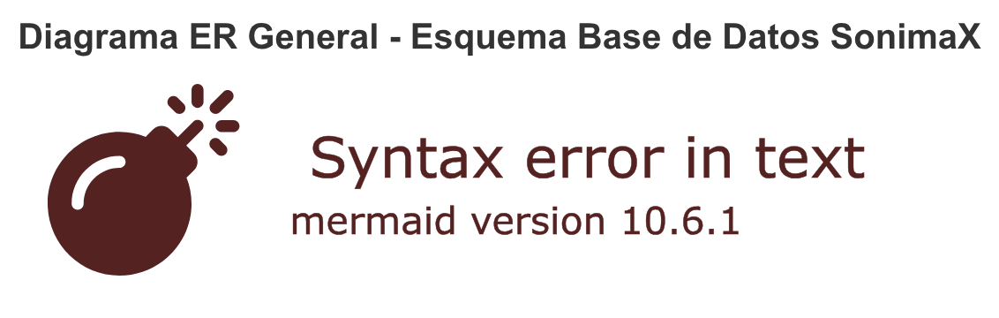

# Blueprint del Esquema de Base de Datos para SonimaX



## Resumen ejecutivo

Este documento especifica el blueprint técnico del esquema de base de datos para SonimaX, una plataforma de grabación de audio de campo con capacidades de análisis de IA y seguimiento meteorológico. El esquema ha sido diseñado para soportar todas las funcionalidades requeridas y sigue las mejores prácticas del dominio de monitoreo acústico ambiental y field recording.

## Arquitectura del Sistema

### Características principales
- **Escalabilidad horizontal** mediante particionamiento temporal
- **Alta disponibilidad** con redundancia geográfica
- **Análisis en tiempo real** de grabaciones con IA
- **Integración meteorológica** automática
- **Seguimiento GPS preciso** con metadatos de calidad
- **Sistema de tags jerárquico** para clasificación automática
- **Gestión completa de equipos** con trazabilidad de calibraciones

### Tecnologías recomendadas
- **Base de datos principal**: PostgreSQL 15+ con extensiones PostGIS
- **Almacenamiento temporal**: TimescaleDB para datos de series temporales
- **Búsqueda de texto completo**: Integración con Elasticsearch
- **Cache de consultas**: Redis para optimización de rendimiento
- **Análisis geoespacial**: PostGIS para operaciones espaciales complejas

## Estructura de Datos

### Jerarquía Organizacional
```
Usuario → Proyecto → Ruta → Punto de Grabación → Grabación
```

### Jerarquía de Datos
```
Grabación → Metadatos Audio
Grabación → Análisis IA
Grabación → Condiciones Meteorológicas
Grabación → Tags (clasificación)
Punto de Grabación → GPS + Contexto Ambiental
```

## Componentes Técnicos

### 1. Sistema de Usuarios y Autenticación
- **Autenticación segura** con hashing bcrypt y salts únicos
- **Gestión de roles** granular (administrador, investigador, operador, analista)
- **Recuperación de contraseña** con tokens temporales
- **Sesiones activas** con control de concurrencia
- **Preferencias personalizables** en formato JSON

### 2. Gestión de Proyectos y Rutas
- **Organización jerárquica** completa de proyectos
- **Rutas georreferenciadas** con geometrías complejas
- **Metadatos flexibles** para configuración específica
- **Estados de proyecto** con control de flujo de trabajo
- **Permisos granulares** por proyecto y usuario

### 3. Sistema de Puntos de Grabación
- **Precisión GPS** con validación de coordenadas
- **Metadatos ambientales** completos
- **Horizonte visible** y obstáculos documentados
- **Trazabilidad temporal** con timestamps GPS
- **Condiciones de contexto** para análisis posterior

### 4. Gestión de Equipos y Calibración
- **Catálogo completo** de equipos por categoría
- **Trazabilidad de calibraciones** con certificados digitales
- **Ciclos de mantenimiento** programados y alertas
- **Historial de uso** por equipo y proyecto
- **Configuraciones de calibración** versionadas

### 5. Sistema de Grabaciones y Metadatos
- **Metadatos técnicos extensivos** (codec, sample rate, etc.)
- **Análisis de calidad automática** (SNR, RMS, Peak)
- **Hashes de integridad** para validación de archivos
- **Metadatos estandarizados** (ID3, XMP, Vorbis)
- **Procesamiento de señales** con versiones y trazabilidad

### 6. Análisis de IA Integrado
- **Modelos versionados** con trazabilidad completa
- **Procesamiento asíncrono** con estados definidos
- **Métricas de rendimiento** detalladas
- **Configuraciones flexibles** por modelo
- **Validación de resultados** con confianza

### 7. Sistema de Tags Jerárquico
- **Categorías especializadas**: especies, fuentes, ubicaciones, técnicas
- **Sistema de slugs** únicos para URLs amigables
- **Colores y iconos** personalizables
- **Confianza por tag** con contexto temporal
- **Tags automáticos** derivados de análisis de IA

### 8. Condiciones Meteorológicas
- **Variables conformes EPA**: temperatura, humedad, presión, viento, precipitación
- **Datos de atmósfera superior** para análisis avanzados
- **Control de calidad** con estados de validación
- **Metadatos de medición** completos
- **Procesamiento de datos** automático

### 9. Configuraciones Dinámicas
- **Configuraciones por nivel**: usuario, proyecto, ruta
- **Tipos especializados**: grabación, análisis, procesamiento, UI
- **Gestión de versiones** con heredabilidad
- **Configuraciones activas** y plantillas
- **Parámetros optimizables** por contexto

## Optimizaciones de Rendimiento

### Índices Especializados
- **Índices geométricos** PostGIS para consultas espaciales
- **Índices compuestos** para consultas frecuentes
- **Índices GIN/GIST** para búsquedas de texto y JSON
- **Índices de partituras** para datos temporales
- **Índices parciales** para estados activos

### Particionamiento
- **Particionamiento temporal** de grabaciones por mes
- **Particionamiento meteorológico** por trimestre
- **Archivado automático** de datos antiguos
- **Vacuum automático** para optimización de espacio

### Vistas Materializadas
- **Resumen de proyectos** con estadísticas actualizadas
- **Calidad de grabaciones** agregada por criterios
- **Análisis de biodiversidad** por ubicación
- **Métricas de sistema** para monitoreo

## Integraciones y APIs

### APIs RESTful
- **Endpoints para CRUD** de todas las entidades principales
- **APIs de búsqueda** con filtros avanzados
- **APIs de análisis** para resultados de IA
- **APIs de exportación** en múltiples formatos
- **APIs de reportes** con agregaciones complejas

### Integraciones Externas
- **Sistemas meteorológicos** (APIs NOAA, estaciones locales)
- **Plataformas de análisis de IA** (BirdNET, modelos personalizados)
- **Sistemas GIS** para análisis geoespacial avanzado
- **Plataformas de visualización** (Tableau, QGIS)
- **Sistemas de backup** para redundancia

## Seguridad y Compliance

### Medidas de Seguridad
- **Encriptación de datos** en reposo y en tránsito
- **Auditoría completa** de acceso y modificaciones
- **Control de acceso granular** basado en roles
- **Validación de entrada** para prevenir inyecciones
- **Backups cifrados** con retención definida

### Compliance
- **Estándares GDPR** para privacidad de datos
- **ISO 27001** para seguridad de la información
- **SOX compliance** para integridad de datos financieros
- **Estándares ambientales** para datos de monitoreo
- **Trazabilidad científica** para reproducibilidad

## Monitoreo y Alertas

### Métricas del Sistema
- **Performance de consultas** con análisis de cuellos de botella
- **Uso de recursos** de CPU, memoria y almacenamiento
- **Latencia de APIs** con SLAs definidos
- **Disponibilidad de servicios** con uptime monitoring
- **Calidad de datos** con validación automática

### Sistema de Alertas
- **Alertas de calidad** para datos anómalos
- **Notificaciones de mantenimiento** de equipos
- **Alertas de seguridad** para accesos sospechosos
- **Notificaciones de sistema** para fallos de hardware
- **Reportes automáticos** de status de proyectos

## Roadmap de Implementación

### Fase 1: Fundación (Meses 1-2)
- [ ] Configuración de infraestructura base
- [ ] Implementación de esquema de datos core
- [ ] Sistema de usuarios y autenticación
- [ ] APIs básicas CRUD

### Fase 2: Core Funcional (Meses 3-4)
- [ ] Sistema de proyectos y rutas
- [ ] Gestión de grabaciones y metadatos
- [ ] Integración de equipos y calibraciones
- [ ] Interfaz web básica

### Fase 3: Análisis Avanzado (Meses 5-6)
- [ ] Integración de IA para análisis automático
- [ ] Sistema de tags inteligente
- [ ] Condiciones meteorológicas
- [ ] Vistas de análisis y reportes

### Fase 4: Optimización (Meses 7-8)
- [ ] Optimización de rendimiento
- [ ] Implementación de particionamiento
- [ ] Sistema de monitoreo completo
- [ ] Testing y validación extensiva

### Fase 5: Producción (Meses 9-10)
- [ ] Deploy en producción
- [ ] Migración de datos históricos
- [ ] Training de usuarios
- [ ] Go-live y soporte inicial

## Consideraciones Futuras

### Escalabilidad
- **Microservicios** para componentes independientes
- **Sharding horizontal** para distribución geográfica
- **Caching distribuido** con Redis Cluster
- **Message queues** para procesamiento asíncrono
- **Load balancing** automático

### Funcionalidades Avanzadas
- **Machine learning** para predicción de calidad
- **Análisis predictivo** de biodiversidad
- **Integración IoT** para sensores automáticos
- **Análisis de streaming** en tiempo real
- **APIs GraphQL** para consultas complejas

### Extensibilidad
- **Plugins** para análisis personalizados
- **Webhooks** para integraciones externas
- **SDKs** para desarrollo de terceros
- **Templates** para nuevos tipos de proyectos
- **Workflows** personalizables

## Conclusión

El esquema de base de datos SonimaX proporciona una foundation robusta y escalable para la gestión integral de grabaciones de audio de campo con análisis de IA. Su diseño modular permite crecimiento futuro mientras mantiene la integridad de datos y el rendimiento operativo.

La arquitectura propuesta soporta los casos de uso actuales y futuras expansiones, siguiendo las mejores prácticas de la industria y los estándares del dominio de monitoreo acústico ambiental.